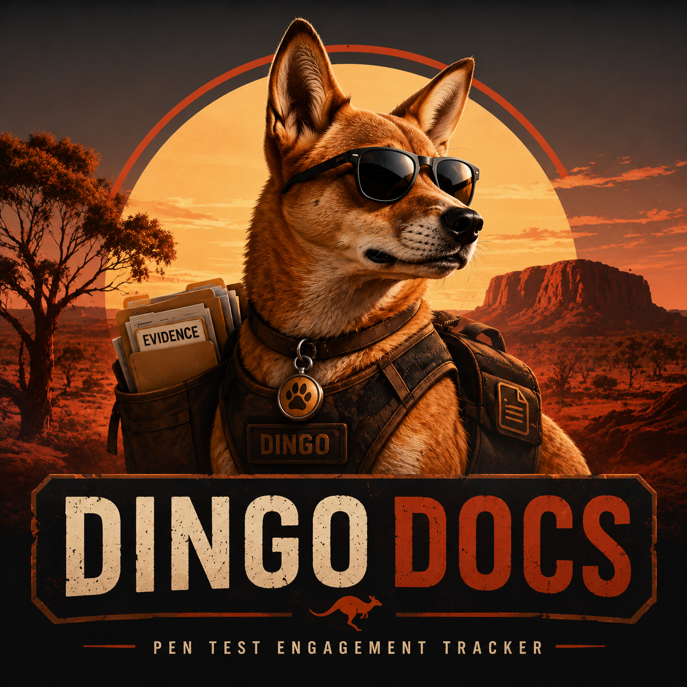
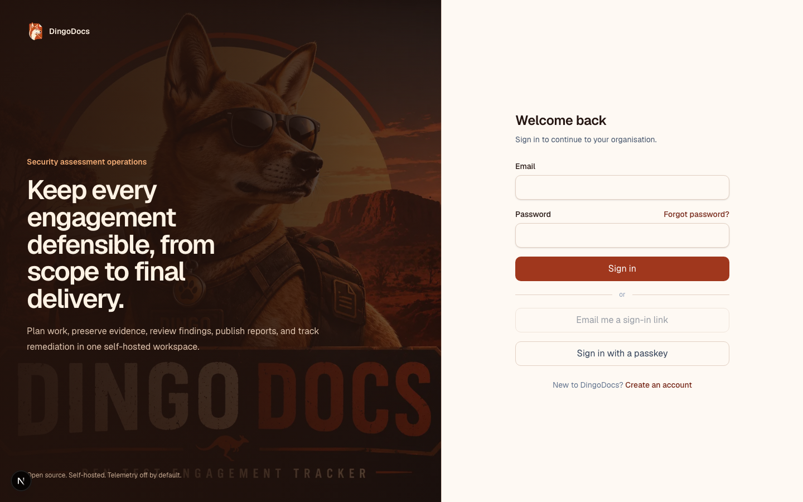
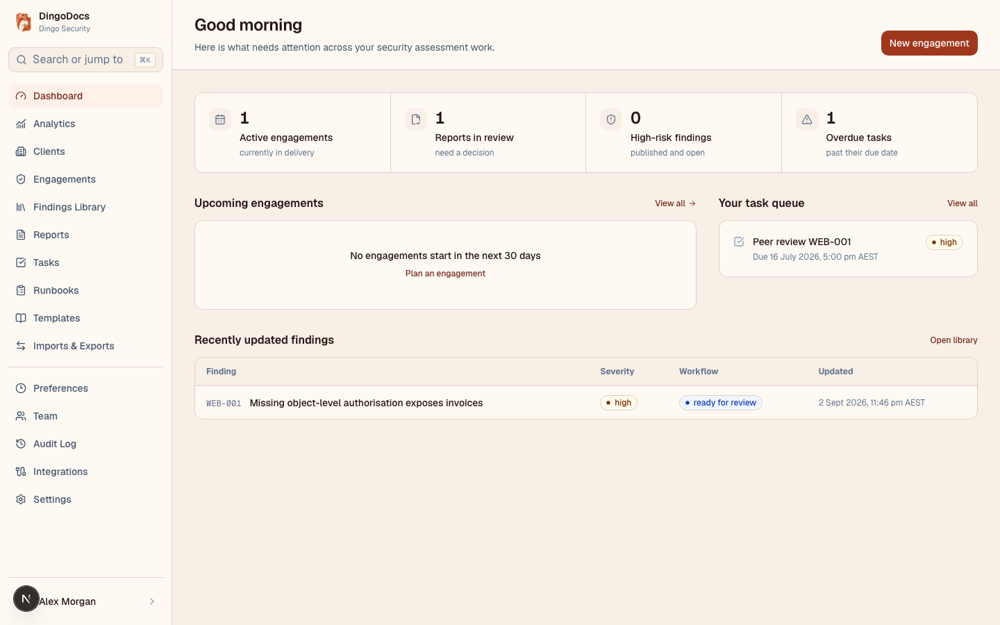
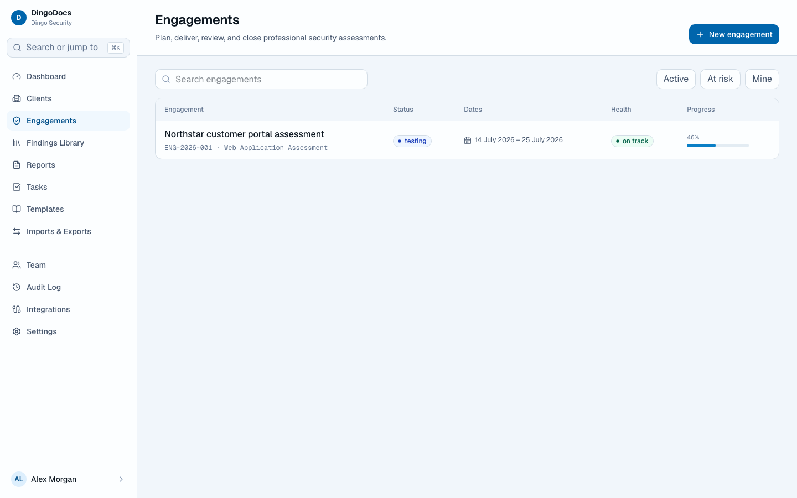
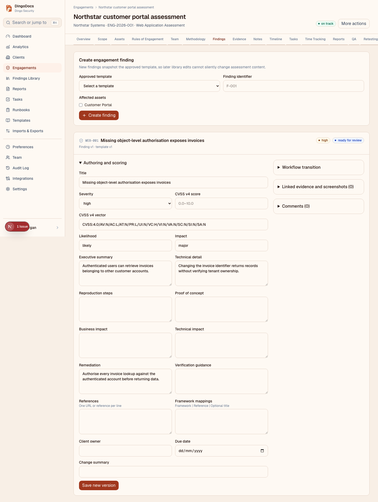
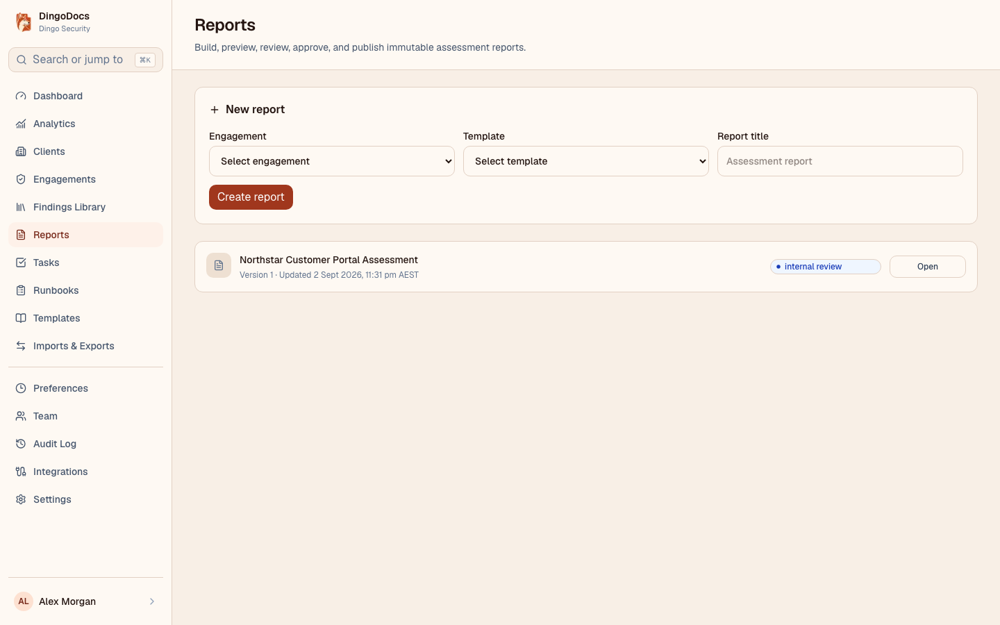
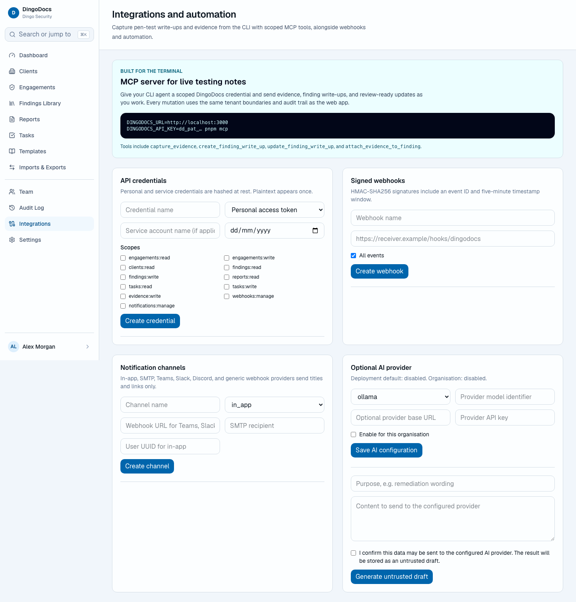

<p align="center">
  
</p>

# DingoDocs

DingoDocs is an open source, self-hosted penetration testing engagement and reporting platform. It keeps scope, assets, evidence, findings, review, reporting, client remediation, and retesting inside one auditable organisation boundary.

The game-changing workflow is the built-in MCP server: pen testers can stay in their CLI and send terminal output, files, finding write-ups, and evidence links into DingoDocs as they work. Each tool call uses a scoped API credential, preserves tenant boundaries, and lands in the same auditable workflow as the web app.

The platform also provides the complete assessment workflow: Next.js 16, Better Auth, PostgreSQL through Drizzle, organisation-aware RBAC, tenant-scoped repositories, append-only audit events, local/S3-compatible storage, background jobs, engagement delivery, reporting, and a restricted client remediation and retesting portal.

## MCP for pen testers

Connect any MCP-capable CLI agent to DingoDocs in seconds. Create a personal or service credential in **Integrations and automation** with `engagements:read`, `findings:read`, `findings:write`, and `evidence:write`, then add this server to your MCP client:

```json
{
  "mcpServers": {
    "dingodocs": {
      "command": "pnpm",
      "args": ["mcp"],
      "env": {
        "DINGODOCS_URL": "http://localhost:3000",
        "DINGODOCS_API_KEY": "dd_pat_replace-with-your-one-time-secret"
      }
    }
  }
}
```

From the terminal, the server exposes `list_engagements`, `list_findings`, `capture_evidence`, `create_finding_write_up`, `update_finding_write_up`, and `attach_evidence_to_finding`. Evidence can be captured directly from command output or a local file, so the write-up grows alongside the test instead of after it.

## Interface preview



<details>
<summary>View the product tour</summary>

| SOC-style dashboard                                    | Engagement workflow                                        |
| ------------------------------------------------------ | ---------------------------------------------------------- |
|  |  |

| Finding workflow                                             | Report workspace                                   |
| ------------------------------------------------------------ | -------------------------------------------------- |
|  |  |

| Integrations and automation                                  |
| ------------------------------------------------------------ |
|  |

</details>

## Quick start

Requirements: Node.js 20 or newer, pnpm 10, and Docker.

```bash
cp .env.example .env
docker compose up -d postgres mailpit
pnpm install
pnpm db:migrate
pnpm db:seed
pnpm dev
```

Open `http://localhost:3000` and sign in with the seeded local account:

- Email: `admin@dingodocs.local`
- Password: `DingoDocs-Demo-2026!`

Change or remove demo credentials before using any non-development deployment. Mailpit is available at `http://localhost:8025`.

For a production-style local deployment, set a strong `BETTER_AUTH_SECRET` and run:

```bash
docker compose up -d
```

The Compose migration service applies PostgreSQL migrations before the application starts. MinIO is optional and starts with `docker compose --profile s3 up -d`.

## Commands

```text
pnpm dev             Start the development server
pnpm build           Create a production build
pnpm lint            Run ESLint
pnpm typecheck       Run strict TypeScript checks
pnpm test            Run unit and configured integration tests
pnpm test:e2e        Run Playwright tests
pnpm mcp             Start the DingoDocs MCP server over stdio
pnpm db:generate     Generate a Drizzle migration
pnpm db:migrate      Apply migrations
pnpm db:seed         Load local demonstration data
pnpm db:studio       Open Drizzle Studio
pnpm docker:up       Start Compose services
pnpm docker:down     Stop Compose services
```

## Architecture

Domain schema is split under `src/db/schema`. Protected operations resolve the authenticated user and revalidate active organisation membership on the server. Repositories require a tenant scope and include `organisation_id` in record lookups. UI visibility is never treated as authorisation.

See [Architecture](docs/architecture.md), [Deployment](docs/deployment.md), [Administrator guide](docs/admin-guide.md), [User guide](docs/user-guide.md), [Client portal guide](docs/client-portal-guide.md), [Backup/restore](docs/backup-restore.md), [Upgrade](docs/upgrade.md), [Threat model](docs/threat-model.md), [Data flow](docs/data-flow.md), [Security model](docs/security.md), [API](docs/api.md), and [Integration operations](docs/integrations.md).

## Project status

DingoDocs is under active development. The engagement workspace, secure evidence lifecycle, formal finding workflow, report rendering, authentication hardening, retention operations, audit model, client remediation and retesting, scanner exchange, checksummed organisation exports, PostgreSQL global search, and local/S3-compatible storage are implemented.

## Licence

Apache License 2.0. No telemetry, licence keys, proprietary cloud dependency, or paid feature gating is included.
