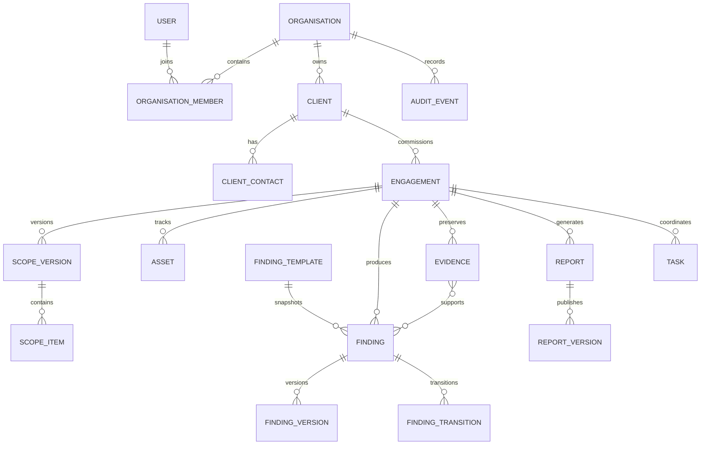

# Architecture

DingoDocs is a Next.js 16 App Router monolith. React Server Components render protected data by default; Client Components are limited to browser interactions such as the command palette and responsive navigation. Server Actions handle first-party mutations, Route Handlers expose versioned integration APIs, and services/repositories hold business and persistence logic.

## Boundaries

- `src/app`: routes, layouts, Route Handlers, and thin request composition
- `src/features`: domain workflow rules independent of React
- `src/server/actions`: validated first-party mutations
- `src/server/services`: multi-step domain orchestration
- `src/server/repositories`: tenant-aware persistence access
- `src/db/schema`: domain-separated Drizzle schemas
- `src/lib/auth`: Better Auth and session resolution
- `src/lib/permissions`: RBAC matrix and authoritative server checks
- `src/lib/storage`: local and S3-compatible storage providers
- `src/lib/jobs`: PostgreSQL-backed job claiming, retries, and dead-letter state
- `src/lib/audit`: redacted audit event recording

## Entity overview

## Authentication

Better Auth owns users, credential and OAuth accounts, sessions, verification tokens, and TOTP records through its Drizzle adapter. Session tokens are secure HTTP-only cookies. The route proxy is only a fast redirect path; protected layouts, Server Actions, and Route Handlers resolve the session again on the server. Authentication tables remain separate from the engagement domain while foreign keys preserve attribution.

Email/password, magic-link, TOTP, session revocation data, and OAuth proxy foundations are configured. Social and OIDC providers are enabled only when their server-side environment credentials are configured.

## Authorisation and multi-tenancy

Every organisation-owned table contains `organisation_id`. An active-organisation cookie is a hint, never authority. `resolveActiveOrganisation` checks that hint against current membership and falls back only to another valid membership. Server operations call `requirePermission`; repository lookups accept a server-derived tenant scope and combine it with record identifiers.

Client-provided organisation identifiers are not accepted as authority. Cross-client and cross-engagement access is further constrained through membership, classification, publication state, and evidence visibility in the relevant services.

## Background work

The application starts the job runner only from `instrumentation.ts` in the Node.js runtime. PostgreSQL rows are claimed with `FOR UPDATE SKIP LOCKED`. Failed jobs use exponential backoff and reach `dead_letter` after their configured attempt limit. Report rendering, large imports, evidence processing, notification delivery, and retention work register handlers against this mechanism.
