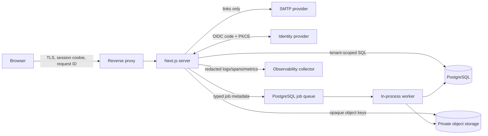

# Data-flow and trust boundaries

The browser receives rendered authorised data and secure cookies, never provider secrets, password hashes, raw OAuth tokens, storage credentials, or job payloads. The proxy adds/forwards a correlation ID, but the server revalidates the session, organisation membership, role, and resource scope for every protected operation.

Evidence enters through signature/type/size validation, is hashed, written under an opaque private key, scanned asynchronously, classified, and audited. Authorised preview/download streams through the server or a short-lived signed URL. Retention jobs delete eligible blobs only after excluding active legal holds and retain destruction metadata.

Scanner imports cross the same upload boundary, reject XML document types/entities, validate adapter structure, and preserve the immutable source before staging normalised rows. Selective application creates draft findings/assets with source fingerprints and provenance; tenant predicates cover preview, duplicate detection, and application. Organisation exports are server-derived, checksummed, audited JSON and expose evidence metadata rather than private storage keys.

Authentication email contains a short-lived link only. Identity providers receive the minimum configured OIDC scopes. Structured logs, readiness, job metrics, and trace attributes contain identifiers/status/timing but exclude request bodies, tokens, evidence, findings, and report content.
